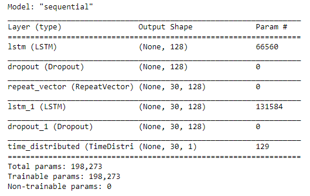
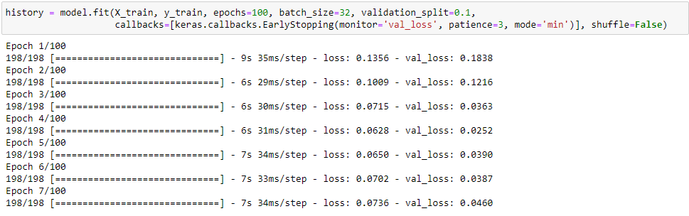

# Timeseries-anomaly-detection-using-LSTM
Timeseries anomaly detection using LSTM: Johnson &amp; Johnson (JNJ) daily data from 1985 to 2020

# Background:

**Long short-term memory (LSTM)** is an artificial recurrent neural network (RNN) architecture used in the field of deep learning. Unlike standard feedforward neural networks, LSTM has feedback connections. It can process not only single data points (such as images), but also entire sequences of data (such as speech or video). For example, LSTM is applicable to tasks such as unsegmented, connected handwriting recognition, speech recognition and **anomaly detection** in network traffic or IDSs (intrusion detection systems).

# Jupiter Notebook:
https://github.com/trajceskijovan/Timeseries-anomaly-detection-using-LSTM/blob/main/Timeseries%20anomaly%20detection%20using%20LSTM.ipynb

# Highlights:

